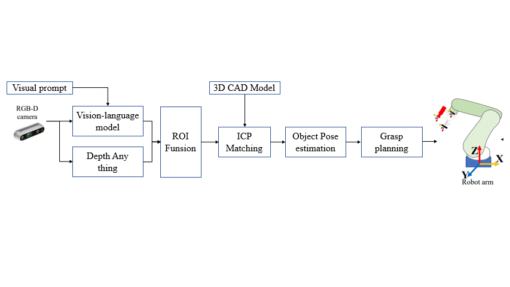

Run main.py
# This algorithm includes:
- Use the zero-shot learning-based Segmentation to identify the object. 
- Use the zero-shot learning-Depth estimation to estimate the depth of the object.
- Use the ICP algorithm (different methods) to estimate the pose of the object.
# There is flowchart.

# Refs

1. [Deep Learning-Based Object Pose Estimation: A Comprehensive Survey](https://github.com/CNJianLiu/Awesome-Object-Pose-Estimation)

2. [YOLOE: Real-Time Seeing Anything](https://arxiv.org/abs/2503.07465).

3. [Depth Anything V2](https://openaccess.thecvf.com/content/CVPR2024/papers/Yang_Depth_Anything_Unleashing_the_Power_of_Large-Scale_Unlabeled_Data_CVPR_2024_paper.pdf)

4. [DepthFM: Fast Monocular Depth Estimation with Flow Matching](https://github.com/CompVis/depth-fm/tree/main).
